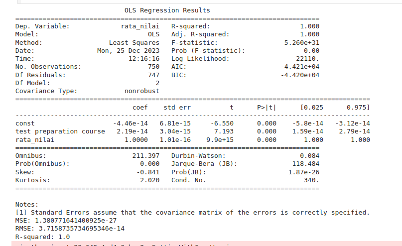
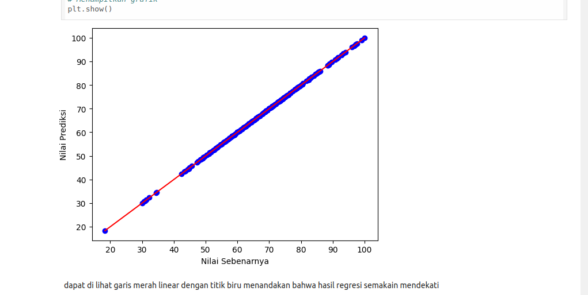

# Analisis Kinerja Siswa: Pendekatan ANOVA dan Regresi Linear

## Pendahuluan

Proyek ini bertujuan untuk menganalisis faktor-faktor yang mempengaruhi kinerja siswa. Analisis akan dilakukan menggunakan teknik statistik ANOVA (Analysis of Variance) dan regresi linear.

## Tujuan

* **Mengenalpasti** variabel-variabel independen yang memiliki pengaruh signifikan terhadap variabel dependen (kinerja siswa).
* **Membangun** model regresi linear untuk memprediksi kinerja siswa berdasarkan variabel-variabel independen yang signifikan.
* **Memvisualisasikan** hasil analisis untuk memudahkan interpretasi.

## Data

* **Sumber data:** Dataset Kaggle
* **Variabel:**
    * **Dependen:** Nilai Ujian
    * **Independen:**
        *  jenis kelamin,dan kelompok sosial ekonomi

## Metodologi

1. **Eksplorasi Data:**
    * Membersihkan data: Menghapus data yang hilang, mendeteksi outlier.
    * Visualisasi: Membuat histogram, boxplot, scatter plot untuk memahami distribusi data.
2. **ANOVA:**
    * Membandingkan rata-rata kinerja siswa berdasarkan kelompok-kelompok yang berbeda (misal: jenis kelamin, kelompok umur).
3. **Regresi Linear:**
    * Membangun model regresi untuk memprediksi kinerja siswa berdasarkan variabel independen yang signifikan.
    * Evaluasi model: Menghitung nilai R-squared, MSE, dan melakukan uji signifikansi parameter.
4. **Visualisasi Hasil:**
    * Membuat plot residual untuk mengevaluasi asumsi regresi.
    * Membuat plot prediksi untuk memvisualisasikan hubungan antara variabel prediktor dan variabel respon.

## Hasil

* **Ringkasan hasil ANOVA:** [Jelaskan hasil uji ANOVA, apakah ada perbedaan signifikan antara kelompok?]
* **Model Anova:**
    * Persamaan Anova: Berdasarkan hasil analisis ANOVA, dapat disimpulkan bahwa terdapat perbedaan yang signifikan antara rata-rata nilai siswa laki-laki dan perempuan. Siswa perempuan memiliki rata-rata nilai yang lebih tinggi daripada siswa laki-laki
    * Evaluasi model: R-squared, F-Static
    * 
    * **Model Regresi Linear**
    * Persamaan Anova:Memprediksi nilai siswa berdasarkan nilai sebelumnya
    * Evaluasi model: R-squared, F-Static
    * 
* **Visualisasi:**
    * 

## Kesimpulan

* Korelasi antara Jenis Kelamin dan Performa:  Analisis ini mungkin menunjukkan adanya perbedaan rata-rata performa antara siswa pria dan wanita. Namun, penting untuk dicatat bahwa korelasi tidak sama dengan kausalitas. Faktor lain yang tidak dianalisis mungkin menyebabkan perbedaan ini.
*Nilai sebelumnya dapat menjadi prediktor yang baik untuk nilai selanjutnya, namun ini bukan satu-satunya faktor yang mempengaruhinya.  Analisis ini tidak memperhitungkan faktor-faktor lain seperti motivasi belajar, gaya belajar, dan kualitas pengajaran.
* **Implikasi:** Analisis ini dapat membantu mengidentifikasi pola-pola tertentu dalam kinerja siswa berdasarkan jenis kelamin dan riwayat akademik mereka

## Batasan

* Keterbatasan Analisis:  Penting untuk dicatat bahwa analisis ini hanya melihat sebagian kecil dari faktor-faktor yang mungkin mempengaruhi kinerja siswa.  Generalisasi dari temuan ini ke populasi yang lebih luas harus dilakukan dengan hati-hati.

## Pustaka

* Kaggle

## Alat

* **Bahasa pemrograman:** Phython
* **Library:** Pandas, NumPy, Scikit-learn, Seaborn, dan scipy

